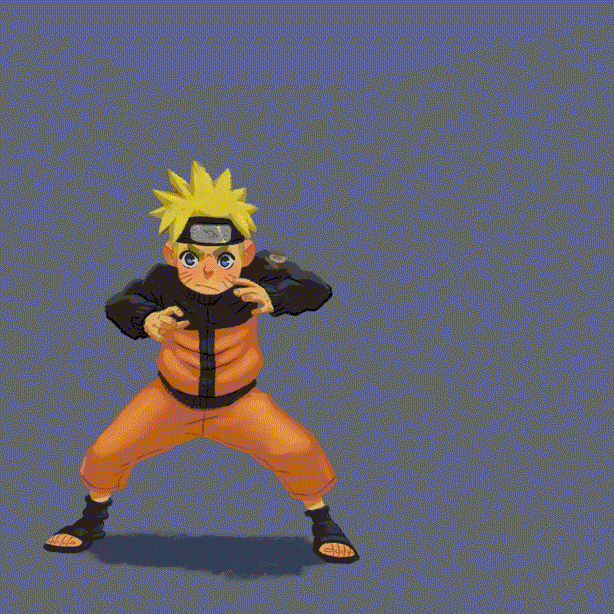

<h1>App Bunshin no Jutsu</h1>

Seja bem-vindo ao repositório que utilizo para armazenar os aplicativos mobile e web que já clonei para praticar e aprender! Ahh, e pra quem nunca viu Naruto, Bushin no Jutsu é uma arte ninja usada para criar clones 😉.

### Twitter Web
Clonado para aprender flex-box e responsividade. Aproveitei pra adicionar o modo escuro 🌒.

  Built with ❤︎ by <a href="https://www.linkedin.com/in/igorryan/">Igor Ryan</a>

